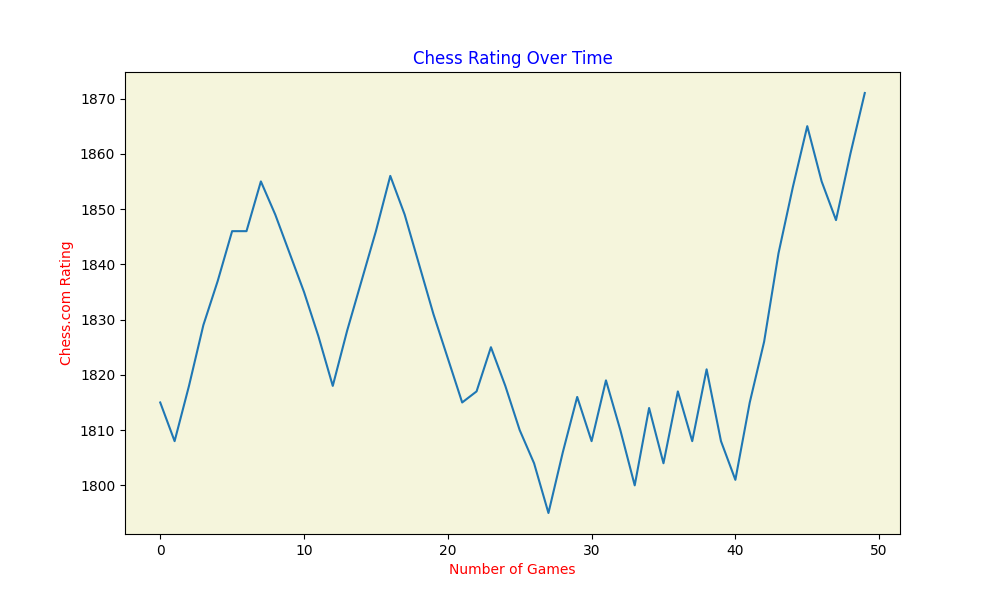

<h1 align="left">Hello, I'm Sayak !!</h1>
<h3 align="left">Engineer | Data Science Enthusiast | Problem Solver | Chess Player ♔♘ </h3>

- 🔭 I’m currently working on **Data Science, Natural Language Processing**

- 🌱 I’m currently learning **Machine Learning, Statistics, Deep Learning, GenAI**

- 💬 Ask me about **[Chess](https://www.chess.com/member/sayak_k), Harry Potter and Sci-Fi movies**

- ⚡ Fun fact **I think I am funny**

### Connect with me:

    
    
    

<h3 align="left">Languages and Tools:</h3>

                 

  
  

## My Chess.com Profile: [Sayak_K](https://www.chess.com/member/sayak_k)
At present my goal is to achieve an ELO rating of 2000 in Rapid on chess.com  ⚡. Below is a record of my last 50 rapid games on chess.com (gets updated automatically daily), along with my overall chess statistics.

### Both my rating chart and my stats automatically gets updated daily.
 

Timestamp: 2024-06-19 06:11:09 IST
